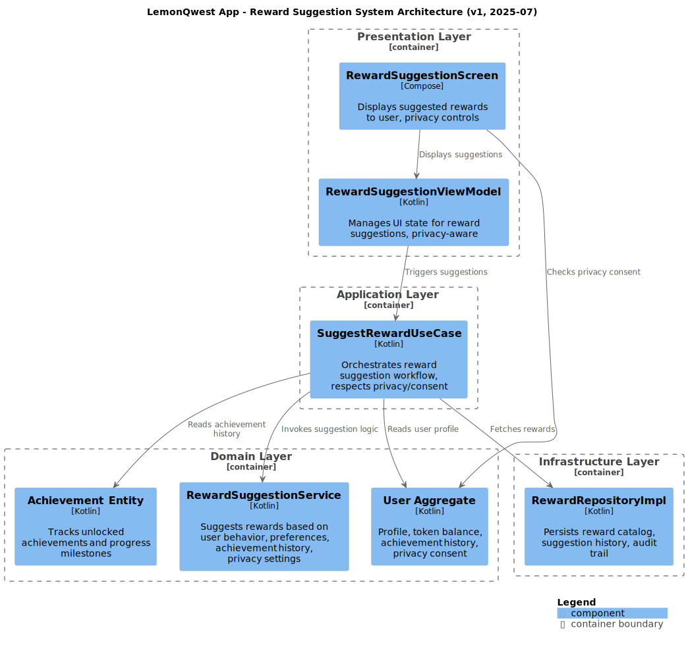
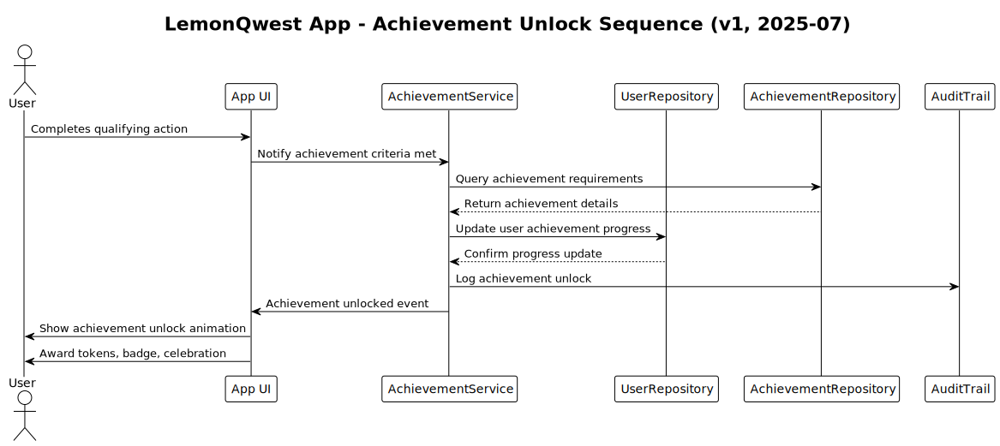
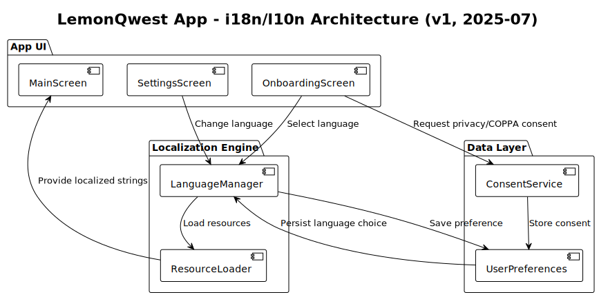
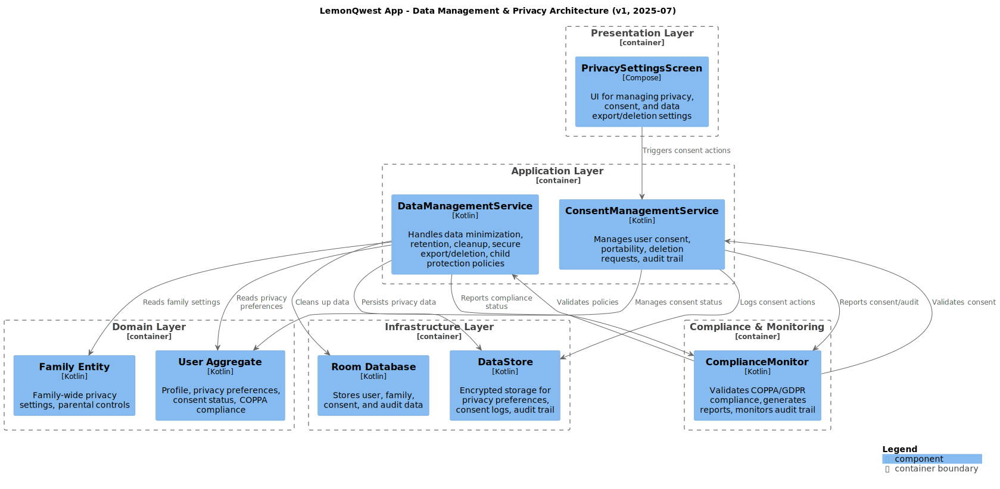
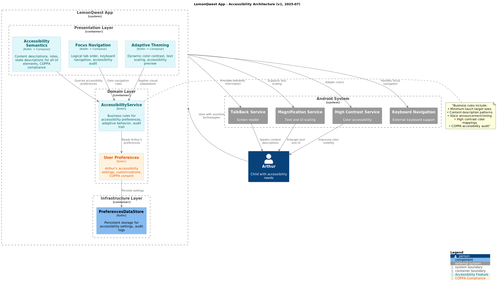

# Arthur's Life Architecture Guide - Technical Documentation

[🏠 Back to Docs Hub](README.md) | [🏠 Main README](../README.md)

Comprehensive guide to the architectural patterns, design principles, and system structure of Arthur's Life family task management app.

## 📋 Document Overview

### Purpose
Document the architectural decisions, design patterns, and structural organization that guide the development of a maintainable, scalable family task management application.

### Audience
- **Primary**: Software architects and senior developers designing system components
- **Secondary**: All developers implementing features and maintaining code
- **Prerequisites**: Understanding of DDD, SOLID principles, and Android development

### Scope
Covers domain-driven design implementation, SOLID principles application, DRY strategies, and overall system architecture. Does not include deployment architecture or infrastructure details.

## 🎯 Quick Reference

### Key Information
- **Summary**: DDD-based architecture with SOLID principles for family task management
- **Related**: [tech-stack.md](tech-stack.md), [development.md](development.md)

### Common Tasks
- [Domain-Driven Design (DDD)](#domain-driven-design-ddd)
- [SOLID Principles](#solid-principles)
- [DRY Strategies](#dry-dont-repeat-yourself)
- [System Structure Overview](#system-architecture)

## 📖 Main Content

### Section 1: Core Concepts

#### Domain-Driven Design (DDD)
Arthur's Life App implements DDD to manage complexity through clear domain modeling:
- **Token Economy**: Digital currency system for completing tasks
- **Role-Based Access**: Child, Caregiver, and Admin user roles
- **Task Management**: Task creation, assignment, completion, scheduling
- **Reward System**: Token-based reward catalog and redemption
- **Family Structure**: Multi-child households with caregiver oversight

#### System Context & Component Overview


#### Domain Model Components
- **Aggregate Roots**: User, Task, Token, Reward
- **Value Objects**: UserRole, TaskCategory, TaskDifficulty, RewardCategory
- **Domain Events**: TaskCompleted, TokensEarned, RewardRedeemed
- **Repository Pattern**: Domain interfaces, infrastructure implementations

#### Database Entity Relationship


#### Token Economy State Machine


#### Reward Suggestion System Architecture


#### Navigation Bar Architecture


#### Sequence: Task Completion


#### Achievement Unlock Sequence


#### Internationalization & Localization Architecture


#### Data Management & Privacy Architecture


#### Onboarding Flows


#### Accessibility Architecture


### Section 2: Implementation Details

#### SOLID Principles
- **Single Responsibility**: Each class has one clear purpose
- **Open/Closed**: Open for extension, closed for modification
- **Liskov Substitution**: Subtypes must be substitutable for base types
- **Interface Segregation**: Focused, cohesive interfaces
- **Dependency Inversion**: Depend on abstractions, not concretions

#### DRY (Don't Repeat Yourself)
- Shared Compose components for UI reuse
- Centralized validation logic
- Single source of truth for app constants

### Section 3: Configuration

#### Layer Organization
```
com.arthurslife.app/
├── domain/           # Business logic and entities
│   ├── user/         # User aggregate
│   ├── task/         # Task management
│   ├── token/        # Token economy
│   ├── reward/       # Reward system
│   └── theme/        # Theme domain models
├── data/             # Data layer implementation
│   ├── local/        # Room database, DataStore
│   ├── repository/   # Repository implementations
│   └── theme/        # Theme preferences data store
├── presentation/     # UI layer with Jetpack Compose
│   ├── screens/      # Screen composables
│   ├── components/   # Reusable UI components
│   ├── theme/        # Role-based theme system
│   └── navigation/   # Type-safe navigation
├── di/               # Hilt dependency injection modules
└── util/             # Shared utility functions
```

#### Data Flow Architecture
1. Presentation Layer: Jetpack Compose UI with ViewModels
2. Domain Layer: Business logic with use cases and entities
3. Data Layer: Repository implementations with Room database
4. Infrastructure: Android-specific concerns and external services

#### Architecture Diagrams
- [Domain Layer Components](diagrams/c4-component.svg)
- [Database Entity Relationship](diagrams/database-entity-relationship.svg)
- [Token Economy State Machine](diagrams/token-economy-state-machine.svg)

### Key Architectural Benefits
- Separation of concerns
- Testability
- Maintainability
- Reusability
- Scalability
- Type safety
- Theme flexibility

## 🔗 Integration Points

### Dependencies
- [Tech Stack](tech-stack.md)
- [Development Guide](development.md)
- [App Structure](../planning/app-structure.md)

### Related Features
- [Theme System](theme-system.md)
- [User Management](../planning/features/user-management.md)
- [Task Management](../planning/features/task-management.md)

## 📊 Success Metrics

### Implementation Goals
- Maintainability: Code follows SOLID principles
- Testability: Domain logic independent of Android framework
- Scalability: DDD patterns support feature growth
- Code Quality: DRY implementation reduces duplication

### Quality Indicators
- Separation of concerns
- Dependency direction toward domain
- Comprehensive test coverage
- Code reuse via shared components

##  Additional Resources

### Internal Documentation
- [Getting Started](getting-started.md)
- [Tech Stack](tech-stack.md)
- [Testing Guide](testing.md)
- [Development Guide](development.md)

### External Resources
- [Domain-Driven Design](https://domainlanguage.com/ddd/)
- [SOLID Principles](https://en.wikipedia.org/wiki/SOLID)
- [Clean Architecture](https://blog.cleancoder.com/uncle-bob/2012/08/13/the-clean-architecture.html)
- [Android Architecture Guide](https://developer.android.com/topic/architecture)

---

## 📝 Contributing

### How to Contribute
1. Follow architectural principles (DDD, SOLID, DRY)
2. Update documentation for architectural changes
3. Validate new features against established patterns
4. Test architectural boundaries

### Review Process
1. Architecture review for principle adherence
2. Code review for pattern compliance
3. Documentation review for updates
4. Integration testing for boundary validation

### Style Guidelines
- Follow domain modeling patterns
- Maintain separation of concerns
- Document architectural decisions and rationale
- Include code examples for clarity

---

**Navigation**: [🏠 Docs Hub](README.md) | [🏠 Main README](../README.md) | [📋 Planning](../planning/README.md)
