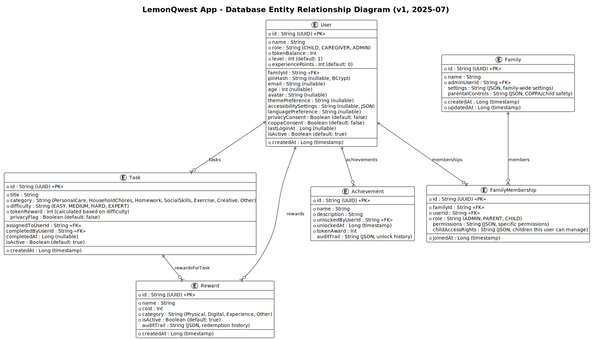

# Architecture & Design Principles - Technical Documentation

[🏠 Back to Docs Hub](README.md) | [🏠 Main README](../README.md)

Comprehensive guide to the architectural patterns, design principles, and system structure of Arthur's Life family task management app.

## 📋 Document Overview

### Purpose
Document the architectural decisions, design patterns, and structural organization that guide the development of a maintainable, scalable family task management application.

### Audience
- **Primary**: Software architects and senior developers designing system components
- **Secondary**: All developers implementing features and maintaining code
- **Prerequisites**: Understanding of DDD, SOLID principles, and Android development

### Scope
Covers domain-driven design implementation, SOLID principles application, DRY strategies, and overall system architecture. Does not include deployment architecture or infrastructure details.

## 🎯 Quick Reference

### Key Information
- **Summary**: DDD-based architecture with SOLID principles for family task management
- **Status**: Complete - actively maintained
- **Last Updated**: 2025-01-06
- **Related**: [Tech Stack](tech-stack.md), [Development Guide](development.md)

### Common Tasks
- [Understanding Domain Model](#domain-driven-design-ddd)
- [Implementing SOLID Principles](#solid-principles)
- [Applying DRY Strategies](#dry-dont-repeat-yourself)
- [System Structure Overview](#system-architecture)

## Domain-Driven Design (DDD)

### Core Concepts

Arthur's Life App implements DDD to manage the complexity of family task management through clear domain modeling:

- **Token Economy**: Digital currency system for completing tasks
- **Role-Based Access**: Child, Caregiver, and Admin user roles with different permissions
- **Task Management**: Task creation, assignment, completion, and scheduling
- **Reward System**: Token-based reward catalog and redemption
- **Family Structure**: Multi-child households with caregiver oversight

### Domain Model Components

#### Aggregate Roots
- **User**: Family member with role, tokens, and authentication
- **Task**: Work items with categories, difficulty, and completion tracking
- **Token**: Digital currency for the reward economy
- **Reward**: Items and privileges available for token redemption

#### Value Objects
- **UserRole**: Child, Caregiver, Admin enumeration
- **TaskCategory**: Chore, homework, personal care classifications
- **TaskDifficulty**: Easy, medium, hard with token values
- **RewardCategory**: Digital, physical, privilege types

#### Domain Events
- **TaskCompleted**: Triggered when a child completes a task
- **TokensEarned**: Fired when tokens are awarded for task completion
- **RewardRedeemed**: Raised when tokens are spent on rewards
- **UserRoleChanged**: Emitted when user permissions are modified

#### Repository Pattern
```kotlin
// Domain interface
interface TaskRepository {
    suspend fun findByUserId(userId: String): Flow<List<Task>>
    suspend fun save(task: Task): Result<Task>
    suspend fun findById(taskId: String): Task?
}

// Implementation in data layer
class RoomTaskRepository(
    private val taskDao: TaskDao,
    private val mapper: TaskMapper
) : TaskRepository {
    // Implementation details
}
```

### DDD Implementation Rules

1. **Aggregate Boundaries**: Each aggregate maintains its own consistency
2. **Domain Events**: Use events for cross-aggregate communication
3. **Value Objects**: Immutable objects for concept representation
4. **Domain Services**: Business logic that doesn't belong to entities
5. **Repository Abstractions**: Keep domain independent of data concerns

## SOLID Principles

### Single Responsibility Principle (SRP)
Each class has one clear purpose and reason to change.

```kotlin
// Good: Focused responsibility
class TaskValidator {
    fun validate(task: Task): ValidationResult {
        // Only validation logic
    }
}

class TaskRepository {
    suspend fun save(task: Task): Result<Task> {
        // Only data persistence logic
    }
}

// Bad: Multiple responsibilities
class TaskService {
    fun validate(task: Task): ValidationResult { /* validation */ }
    suspend fun save(task: Task): Result<Task> { /* persistence */ }
    fun sendNotification(task: Task) { /* notification */ }
}
```

### Open/Closed Principle (OCP)
Open for extension, closed for modification.

```kotlin
// Extensible reward provider interface
interface RewardProvider {
    fun getAvailableRewards(userRole: UserRole): List<Reward>
    fun canRedeem(reward: Reward, tokens: Int): Boolean
}

// Implementations for different reward types
class DigitalRewardProvider : RewardProvider { /* implementation */ }
class PhysicalRewardProvider : RewardProvider { /* implementation */ }
class PrivilegeRewardProvider : RewardProvider { /* implementation */ }
```

### Liskov Substitution Principle (LSP)
Subtypes must be substitutable for their base types.

```kotlin
// All implementations work interchangeably
fun processRewards(provider: RewardProvider, user: User) {
    val rewards = provider.getAvailableRewards(user.role)
    // Works with any RewardProvider implementation
}
```

### Interface Segregation Principle (ISP)
Create focused, cohesive interfaces.

```kotlin
// Focused interfaces instead of one large interface
interface TaskReader {
    suspend fun findById(id: String): Task?
    suspend fun findByUserId(userId: String): Flow<List<Task>>
}

interface TaskWriter {
    suspend fun save(task: Task): Result<Task>
    suspend fun delete(taskId: String): Result<Unit>
}

// Clients depend only on what they need
class TaskDisplayViewModel(
    private val taskReader: TaskReader // Only needs read operations
)

class TaskCreationViewModel(
    private val taskWriter: TaskWriter, // Only needs write operations
    private val taskValidator: TaskValidator
)
```

### Dependency Inversion Principle (DIP)
Depend on abstractions, not concretions.

```kotlin
// High-level module depends on abstraction
class TaskCompletionUseCase(
    private val taskRepository: TaskRepository, // Interface
    private val tokenService: TokenService,     // Interface
    private val eventPublisher: EventPublisher  // Interface
) {
    suspend fun completeTask(taskId: String, userId: String): Result<Unit> {
        // Business logic depends on abstractions
    }
}
```

## DRY (Don't Repeat Yourself)

### Code Reuse Strategies

#### Shared Compose Components
```kotlin
// Reusable UI components
@Composable
fun TaskCard(
    task: Task,
    onComplete: () -> Unit,
    modifier: Modifier = Modifier
) {
    // Common task display logic
}

@Composable
fun TokenDisplay(
    tokens: Int,
    modifier: Modifier = Modifier
) {
    // Common token visualization
}
```

#### Common Validation Logic
```kotlin
// Centralized validation rules
object ValidationRules {
    fun validateTaskTitle(title: String): ValidationResult {
        return when {
            title.isBlank() -> ValidationResult.Error("Title cannot be empty")
            title.length < 3 -> ValidationResult.Error("Title too short")
            title.length > 50 -> ValidationResult.Error("Title too long")
            else -> ValidationResult.Success
        }
    }
    
    fun validateTokenAmount(amount: Int): ValidationResult {
        return when {
            amount < 0 -> ValidationResult.Error("Tokens cannot be negative")
            amount > 1000 -> ValidationResult.Error("Token amount too high")
            else -> ValidationResult.Success
        }
    }
}
```

#### Shared Configuration
```kotlin
// Single source of truth for app constants
object AppConfig {
    const val MAX_TASK_TITLE_LENGTH = 50
    const val MIN_TASK_TITLE_LENGTH = 3
    const val MAX_TOKEN_REWARD = 100
    const val MIN_TOKEN_REWARD = 1
    
    object TokenValues {
        const val EASY_TASK = 5
        const val MEDIUM_TASK = 10
        const val HARD_TASK = 20
    }
}
```

## System Architecture

### Layer Organization

```
com.arthurslife.app/
├── domain/              # Business logic and entities
│   ├── user/           # User aggregate with roles and authentication
│   ├── task/           # Task management with categories and completion
│   ├── token/          # Token economy with earning and spending
│   ├── reward/         # Reward system with catalog and redemption
│   └── theme/          # Theme domain models and business logic
├── data/               # Data layer implementation
│   ├── local/         # Room database and DataStore persistence
│   ├── repository/    # Repository pattern implementations
│   ├── mapper/        # Domain/data model mapping
│   └── theme/         # Theme preferences data store
├── presentation/       # UI layer with Jetpack Compose
│   ├── screens/       # Screen composables organized by feature
│   ├── components/    # Reusable UI components following DRY
│   ├── theme/         # Role-based theme system implementation
│   └── navigation/    # Type-safe navigation configuration
├── di/                # Hilt dependency injection modules
└── util/              # Shared utility functions and extensions
```

### Data Flow Architecture

1. **Presentation Layer**: Jetpack Compose UI with ViewModels
2. **Domain Layer**: Business logic with use cases and entities
3. **Data Layer**: Repository implementations with Room database
4. **Infrastructure**: Android-specific concerns and external services

### Component Dependencies

```
Presentation → Domain ← Data
     ↓           ↓        ↓
    UI      Use Cases  Repository
Components   Events   Implementations
```

### Architecture Diagrams

#### Domain Layer Components


The C4 Component diagram shows the detailed structure of Arthur's Life App's domain layer, including:
- **Domain Layer**: Core business logic with User, Task, Reward, and Token entities
- **Application Layer**: Use cases orchestrating domain operations
- **Presentation Layer**: Theme system components including ThemeManager, ThemeViewModel, and theme-aware UI components
- **Infrastructure Layer**: Repository implementations and theme preferences storage

#### Database Entity Relationships


The Entity-Relationship diagram illustrates the complete data model with:
- **11 Core Entities**: User, Family, Task, TokenTransaction, Reward, Achievement, and supporting entities
- **Relationship Mappings**: Foreign key relationships and cardinalities between entities
- **Domain Boundaries**: Clear separation between user management, task system, token economy, and achievement tracking

#### Token Economy State Machine


The state machine diagram captures the complex token economy workflow:
- **Task Lifecycle**: From assignment through completion and validation
- **Token Operations**: Earning, spending, and fraud detection mechanisms
- **Reward System**: Browsing, validation, approval, and fulfillment processes
- **Security States**: Validation failures, purchase denial, and emergency reset procedures

### Key Architectural Benefits

- **Separation of Concerns**: Clear boundaries between layers
- **Testability**: Domain logic independent of Android framework
- **Maintainability**: SOLID principles make code easy to modify
- **Reusability**: DRY approach reduces code duplication
- **Scalability**: DDD patterns support feature growth
- **Type Safety**: Kotlin's type system prevents common errors
- **Theme Flexibility**: Role-based theming system supports diverse user preferences

## 🔗 Integration Points

### Dependencies
- **Internal**: [Tech Stack](tech-stack.md) - Technology choices supporting architecture
- **Internal**: [Development Guide](development.md) - Implementation workflows
- **Planning**: [App Structure](../planning/app-structure.md) - High-level system design

### Related Features
- **Theme System**: Role-based theming architecture in [Theme System](../planning/features/theme-system.md)
- **User Management**: Role-based access control in [User Management](../planning/features/user-management.md)
- **Task Management**: Task domain implementation in [Task Management](../planning/features/task-management.md)

## 📊 Success Metrics

### Implementation Goals
- **Maintainability**: Code follows SOLID principles for easy modification
- **Testability**: Domain logic independent of Android framework
- **Scalability**: DDD patterns support feature growth without architectural changes
- **Code Quality**: DRY implementation reduces duplication and bugs

### Quality Indicators
- **Separation of Concerns**: Clear boundaries between presentation, domain, and data layers
- **Dependency Direction**: All dependencies point inward toward domain
- **Test Coverage**: Domain logic has comprehensive unit test coverage
- **Code Reuse**: Common patterns implemented as shared components

## 🚧 Implementation Status

**Current Status**: Complete

### Completed Features
- [x] Domain-driven design implementation with aggregates and value objects
- [x] SOLID principles applied across all layers
- [x] DRY strategies implemented for common functionality
- [x] Clean architecture with clear layer separation
- [x] Repository pattern for data access abstraction
- [x] Domain events for cross-aggregate communication

### Future Enhancements
- [ ] Event sourcing for audit trail capabilities
- [ ] CQRS implementation for read/write optimization
- [ ] Microservices architecture for cloud deployment
- [ ] Advanced caching strategies for performance

## 🔄 Maintenance

### Regular Updates
- **When to Update**: When adding new aggregates, major refactoring, or architectural changes
- **Update Process**: Review architectural decisions, update diagrams, validate principles
- **Review Schedule**: Monthly architecture review, quarterly comprehensive assessment

### Version History
- **v1.0.0** (2025-01-06): Initial architecture documentation with DDD and SOLID principles

## 📚 Additional Resources

### Internal Documentation
- [Getting Started](getting-started.md) - Development environment setup
- [Tech Stack](tech-stack.md) - Technology choices and rationale
- [Testing Guide](testing.md) - Testing strategies aligned with architecture
- [Development Guide](development.md) - Implementation workflows

### External Resources
- [Domain-Driven Design](https://domainlanguage.com/ddd/) - DDD fundamentals
- [SOLID Principles](https://en.wikipedia.org/wiki/SOLID) - Object-oriented design principles
- [Clean Architecture](https://blog.cleancoder.com/uncle-bob/2012/08/13/the-clean-architecture.html) - Architectural patterns
- [Android Architecture Guide](https://developer.android.com/topic/architecture) - Android-specific patterns

### Tools and Utilities
- [PlantUML](https://plantuml.com/) - Architecture diagram generation
- [Detekt](https://detekt.dev/) - Static analysis for architecture validation
- [Dependency Analysis](https://github.com/autonomousapps/dependency-analysis-android-gradle-plugin) - Dependency validation

---

## 📝 Contributing

### How to Contribute
1. **Follow Architectural Principles**: Ensure new code follows DDD and SOLID principles
2. **Update Documentation**: Reflect architectural changes in this document
3. **Validate Design**: Review new features against established patterns
4. **Test Architecture**: Ensure architectural boundaries are maintained

### Review Process
1. **Architecture Review**: Validate adherence to established principles
2. **Code Review**: Ensure implementation follows documented patterns
3. **Documentation Review**: Update architectural documentation as needed
4. **Integration Testing**: Verify architectural boundaries are maintained

### Style Guidelines
- Follow established domain modeling patterns
- Maintain clear separation of concerns
- Document architectural decisions and rationale
- Include code examples demonstrating principles

---

**Navigation**: [🏠 Docs Hub](README.md) | [🏠 Main README](../README.md) | [📋 Planning](../planning/README.md)
