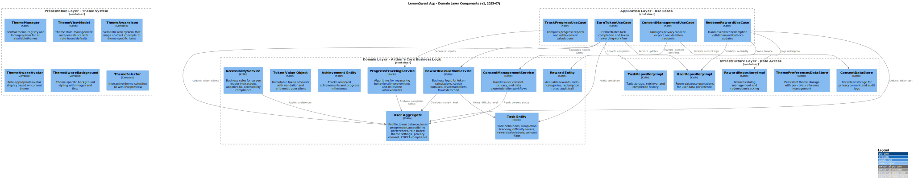
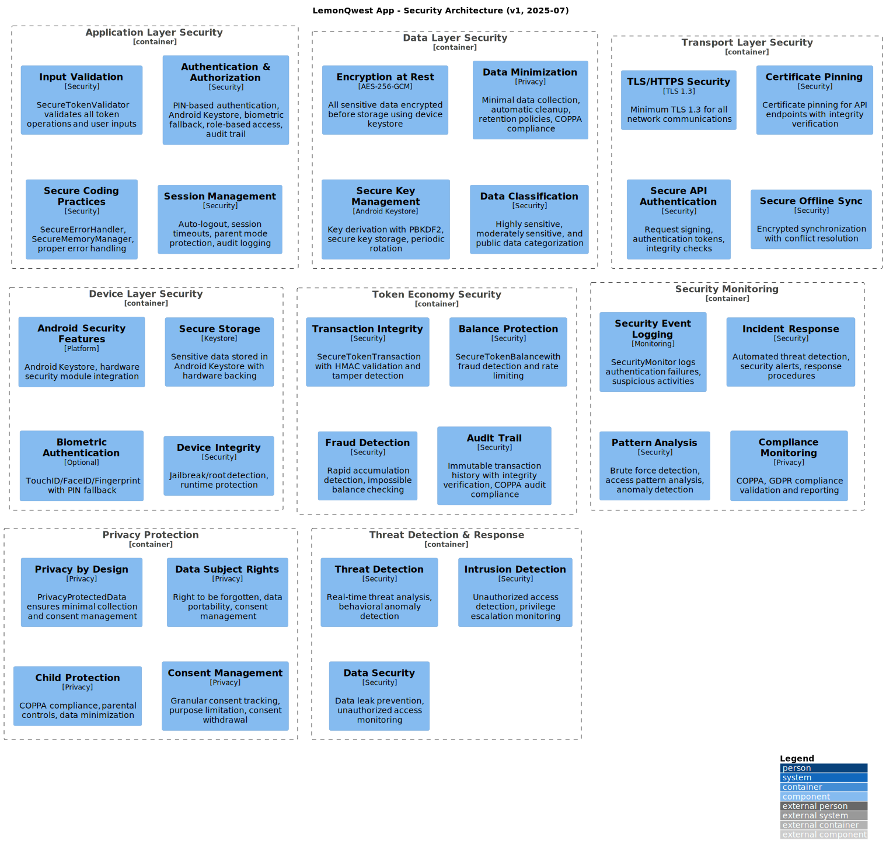
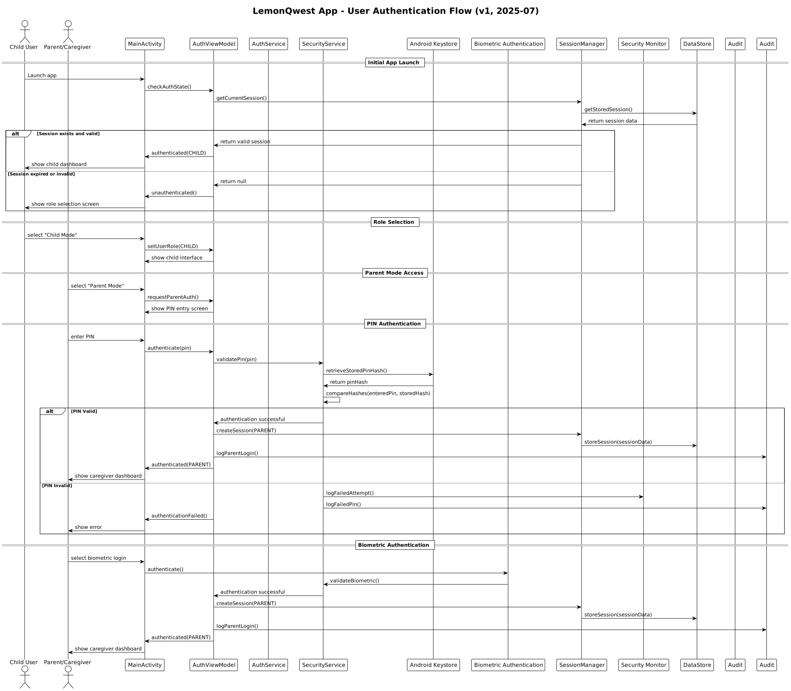
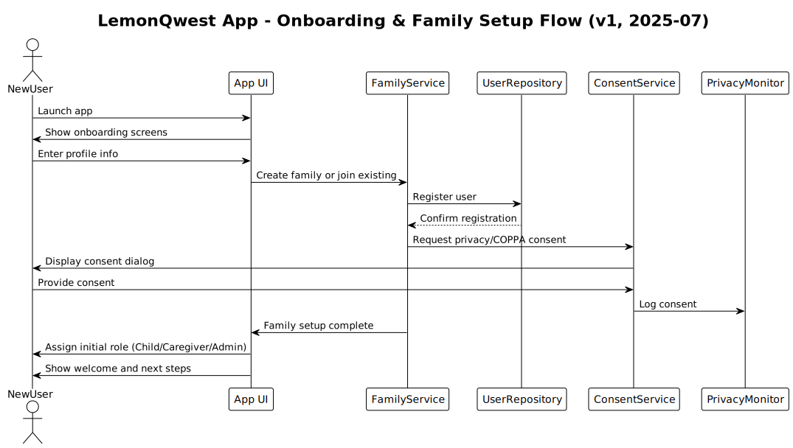

# System Architecture Diagrams

[🏠 Back to Main README](../../README.md) | [📚 Documentation Hub](../README.md)

This folder contains PlantUML diagrams for LemonQwest app. Use these diagrams to visualize and document the system architecture, data flow, security implementation, and domain relationships.

## 📋 Available Diagrams

### C4 Architecture Diagrams

Standard C4 model diagrams showing different levels of system architecture detail.

| Diagram | PlantUML Source | SVG Output | Description |
|---------|----------------|------------|-------------|
| **C4 Context** | [c4-context.puml](c4-context.puml) |  | LemonQwest app in the context of users and external systems |
| **C4 Container** | [c4-container.puml](c4-container.puml) |  | Android app architecture with clean layers and data storage |
| **C4 Component** | [c4-component.puml](c4-component.puml) |  | Domain-driven design component relationships with theme system |

### System Architecture Diagrams

Detailed architectural views of specific system components and patterns.

| Diagram | PlantUML Source | SVG Output | Description |
|---------|----------------|------------|-------------|
| **Theme System Architecture** | [theme-system-architecture.puml](theme-system-architecture.puml) |  | Complete theme management system with role-based defaults |
| **Security Architecture** | [security-architecture.puml](security-architecture.puml) |  | Defense-in-depth security layers and threat protection |
| **Database ERD** | [database-entity-relationship.puml](database-entity-relationship.puml) |  | Complete data model with 11 entities and relationships |
| **Reward Suggestion System Architecture** | [reward-suggestion-system-architecture.puml](reward-suggestion-system-architecture.puml) |  | Suggests rewards based on user behavior, preferences, and achievements |
| **Navigation Bar Architecture** | [navigation-bar-architecture.puml](navigation-bar-architecture.puml) |  | Top/Bottom navigation bar with role-based access and switching |
| **Data Management & Privacy Architecture** | [data-management-privacy-architecture.puml](data-management-privacy-architecture.puml) |  | Data minimization, retention, consent, and compliance |

### Flow and Process Diagrams

Sequence diagrams and state machines showing system behavior and workflows.

| Diagram | PlantUML Source | SVG Output | Description |
|---------|----------------|------------|-------------|
| **Task Completion Flow** | [sequence-task-completion.puml](sequence-task-completion.puml) |  | Arthur completing a task with token rewards |
| **Authentication Flow** | [user-authentication-flow.puml](user-authentication-flow.puml) |  | Complete user authentication and security workflow |
| **Token Economy State Machine** | [token-economy-state-machine.puml](token-economy-state-machine.puml) |  | Token earning, spending, and validation state transitions |
| **Achievement Unlock Sequence** | [achievement-unlock-sequence.puml](achievement-unlock-sequence.puml) |  | Sequence for unlocking achievements, awarding tokens, and celebrations |
| **Onboarding & Family Setup Flow** | [onboarding-flow.puml](onboarding-flow.puml) |  | User onboarding, family creation/join, and initial role assignment |
| **Family Setup & Onboarding Flow (Expanded)** | [family-setup-onboarding-flow.puml](family-setup-onboarding-flow.puml) |  | Expanded onboarding flow with role selection, PIN authentication, and theme setup |

### Specialized Architecture Diagrams

Domain-specific architectural views for specialized concerns.

| Diagram | PlantUML Source | SVG Output | Description |
|---------|----------------|------------|-------------|
| **Accessibility Architecture** | [accessibility-architecture.puml](accessibility-architecture.puml) |  | How accessibility features integrate across the system |
| **i18n/l10n Architecture** | [i18n-l10n-architecture.puml](i18n-l10n-architecture.puml) |  | Internationalization and localization data flow and language management |

## 🔧 Diagram Generation

### Prerequisites

- **Docker** (recommended): No local installation required
- **PlantUML** (alternative): Local Java-based installation

### Generate All Diagrams

```bash
# Using Docker (recommended)
cd docs/diagrams
make docker-svg

# Using local PlantUML
cd docs/diagrams
make svg
```

### Generate Specific Diagrams

```bash
# Generate only theme system diagram
make docker-theme

# Generate only security architecture
make docker-security

# Generate only database ERD
make docker-database

# Generate only authentication flow
make docker-auth

# Generate only token economy state machine
make docker-token
```

### Validate Diagram Syntax

```bash
# Validate all diagrams
make validate-docker

# Check if tools are available
make check-docker
make check
```

## 📊 Diagram Categories

### 🏗️ Architecture Diagrams

- **C4 Context, Container, Component**: Standard architecture views
- **Theme System**: UI theming and role-based customization
- **Security Architecture**: Defense-in-depth security implementation
- **Database ERD**: Complete data model and relationships

### 🔄 Process Flow Diagrams

- **Authentication Flow**: User authentication and session management
- **Task Completion Flow**: Task lifecycle and token earning
- **Token Economy State Machine**: Complex token system workflow

### 🎯 Specialized Diagrams

- **Accessibility Architecture**: Accessibility feature integration
- **Security Components**: Detailed security layer interactions

## 🔗 Integration with Documentation

### Referenced In

- **[Architecture Documentation](../architecture.md)**: Domain layer components, database design, token economy
- **[Security Documentation](../security.md)**: Security architecture and authentication flow
- **[Theme System Documentation](../theme-system.md)**: Theme system architecture and components
- **[Documentation Hub](../README.md)**: Complete diagram index and quick access

### Cross-References

- **Planning Documents**: Feature specifications reference architectural diagrams
- **Technical Documentation**: Implementation guides use flow diagrams
- **Development Workflow**: Architecture reviews use C4 diagrams for decision making

## 📋 Maintenance Guidelines

### When to Update Diagrams

- **Architecture Changes**: Modify C4 diagrams when system structure changes
- **Feature Additions**: Update relevant diagrams when adding new features
- **Security Updates**: Revise security diagrams when changing security implementation
- **Data Model Changes**: Update ERD when modifying database schema

### Update Process

1. **Modify PlantUML Source**: Edit `.puml` files with changes
2. **Regenerate SVG**: Run `make docker-svg` to update visual diagrams
3. **Update Documentation**: Modify referencing documentation as needed
4. **Validate Changes**: Ensure all diagrams render correctly

### Quality Standards

- **Consistency**: Use consistent styling and notation across diagrams
- **Clarity**: Ensure diagrams are readable and well-organized
- **Accuracy**: Keep diagrams synchronized with actual implementation
- **Documentation**: Include comprehensive descriptions for each diagram

## 🎯 Diagram Usage Guidelines

### For Developers

- **Architecture Understanding**: Use C4 diagrams to understand system structure
- **Implementation Planning**: Reference component diagrams during development
- **Flow Understanding**: Study sequence diagrams for complex processes

### For Architects

- **System Design**: Use diagrams for architectural decision making
- **Documentation**: Reference diagrams in architectural documentation
- **Review Process**: Use diagrams in architecture review meetings

### For Security Engineers

- **Security Analysis**: Use security architecture for threat modeling
- **Implementation Validation**: Verify security implementation against diagrams
- **Audit Preparation**: Use diagrams for security audit documentation

## 🔗 Related Documentation

| Topic | Link | Purpose |
|-------|------|---------|
| **Architecture Guide** | [../architecture.md](../architecture.md) | Detailed architectural principles and patterns |
| **Security Guide** | [../security.md](../security.md) | Security implementation and threat model |
| **Theme System** | [../theme-system.md](../theme-system.md) | Theme management system documentation |
| **Development Guide** | [../development.md](../development.md) | Development workflow and practices |
| **Contributing Guide** | [../contributing.md](../contributing.md) | How to contribute to the project |

## 🚀 Quick Start

### View Diagrams

1. **Browse SVG Files**: All generated diagrams are available as SVG files in this directory
2. **Documentation Integration**: View diagrams embedded in technical documentation
3. **GitHub Viewing**: SVG files render directly in GitHub for easy viewing

### Modify Diagrams

1. **Edit PlantUML Source**: Modify `.puml` files with your changes
2. **Generate Updated Diagrams**: Run `make docker-svg` to regenerate
3. **Test Rendering**: Verify diagrams render correctly
4. **Update Documentation**: Modify any referencing documentation

### Add New Diagrams

1. **Create PlantUML File**: Add new `.puml` file in this directory
2. **Update Makefile**: Add generation targets for new diagram
3. **Generate SVG**: Run generation command to create SVG output
4. **Update Documentation**: Reference new diagram in appropriate documentation
5. **Update This README**: Add entry to diagram table

---

**Navigation**: [🏠 Main README](../../README.md) | [📚 Documentation Hub](../README.md) | [🏗️ Architecture](../architecture.md) | [🔒 Security](../security.md)
