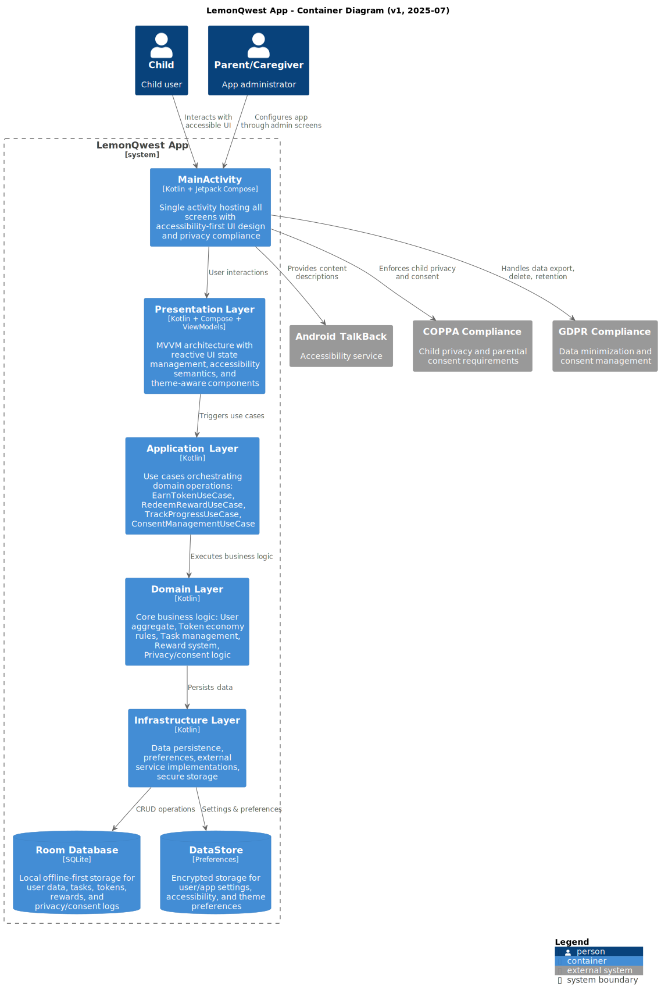

# System Architecture Diagrams

[🏠 Back to Main README](../../README.md)

This folder contains PlantUML diagrams for Arthur's Life app. Use these diagrams
to visualize and document the system architecture before implementation.

## 📋 Available Diagrams

| Diagram | PlantUML Source | SVG Output | Description |
|---------|----------------|------------|-------------|
| **Context** | [c4-context.puml](c4-context.puml) |  | Arthur's Life app in the context of users and external systems |
| **Container** | [c4-container.puml](c4-container.puml) |  | Android app architecture with clean layers |
| **Component** | [c4-component.puml](c4-component.puml) |  | Domain-driven design component relationships |
| **Task Flow** | [sequence-task-completion.puml](sequence-task-completion.puml) |  | Arthur completing a task sequence |
| **Accessibility** | [accessibility-architecture.puml](accessibility-architecture.puml) |  | How accessibility features work together |

## 🔗 Related Documentation

| Topic | Link |
|-------|------|
| **Contributing** | [../contributing.md](../contributing.md) |
| **Architecture** | [../ddd.md](../ddd.md) |
| **Tech Stack** | [../tech-stack.md](../tech-stack.md) |

## Usage Instructions

- Save PlantUML diagrams as `.puml` files in this directory
- Render diagrams to SVG and reference them in the main documentation
- Update diagrams and SVGs whenever the architecture changes
- Reference diagrams in requirements and planning docs as needed

## Rendering Diagrams

```bash
# Render all diagrams to SVG
make -C docs/diagrams all
```

---

[🏠 Back to Main README](../../README.md) | [📝 Contributing](../contributing.md) | [🏗️ Architecture](../ddd.md)
