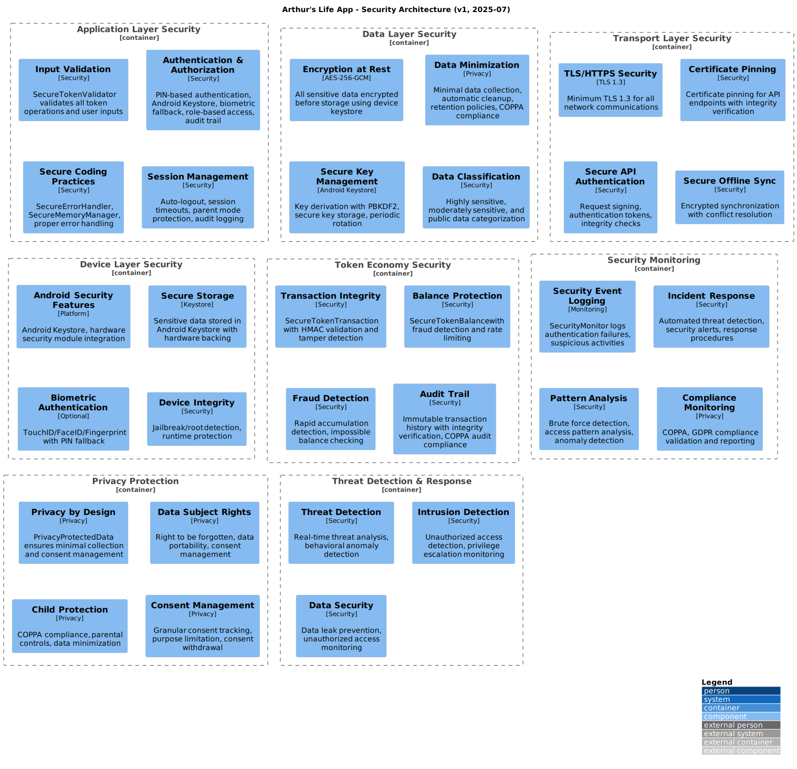
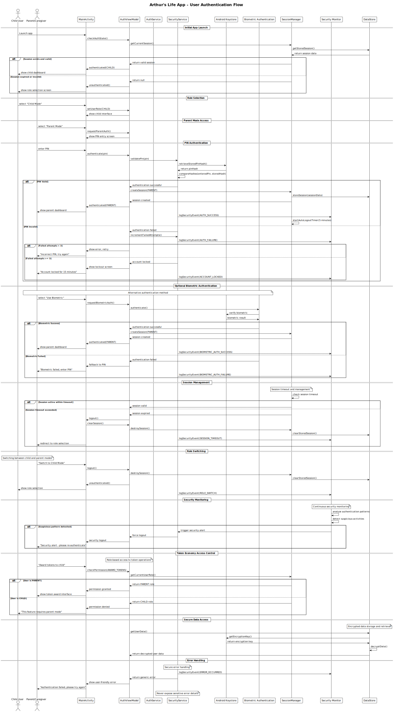

# Security Guide - Technical Documentation

[🏠 Back to Docs Hub](README.md) | [🏠 Main README](../README.md)

Comprehensive security guidelines and practices for protecting children's data and ensuring safe operation of the token economy system.

## 📋 Document Overview

### Purpose

Provide security guidelines, threat analysis, and implementation practices to protect child data and ensure secure operation of the family task management system.

### Audience

- **Primary**: Security engineers and developers
- **Secondary**: All developers working with sensitive data or authentication
- **Prerequisites**: Understanding of security principles, Android security model, and data protection

### Scope

Covers threat modeling, authentication, data protection, privacy practices, and security testing. Includes child safety and token economy security.

## 🎯 Quick Reference

### Key Information

- **Summary**: Security framework for child data protection and token economy
- **Related**: [architecture.md](architecture.md)

### Common Tasks

- [Understanding Threat Model](#threat-model)
- [Implementing Authentication](#security-architecture)
- [Data Protection Practices](#security-overview)
- [Security Testing](#security-testing)

## 📖 Main Content

### Section 1: Core Concepts

#### Security Overview

LemonQwest app handles sensitive child data and implements a financial-like token system, making security paramount. Our security approach focuses on:

- Child Data Protection
- Authentication & Authorization
- Data Integrity
- Privacy by Design
- Offline Security

### Section 2: Implementation Details

#### Threat Model

Primary assets:

1. Child Personal Data
2. Token Economy Data
3. Authentication Credentials
4. Application Logic

Potential threats:

1. Unauthorized Access
2. Data Tampering
3. Privacy Breach
4. Social Engineering
5. Device Compromise

Attack vectors:

- Physical device access
- Network interception
- Malicious apps
- Social engineering
- Vulnerabilities in dependencies

#### Security Architecture

Defense in Depth Strategy:

```
┌─────────────────────────────────────────────┐
│               Application Layer             │
│  • Input validation                         │
│  • Authentication & authorization           │
│  • Secure coding practices                  │
├─────────────────────────────────────────────┤
│                Data Layer                   │
│  • Encryption at rest                       │
│  • Data minimization                        │
│  • Secure key management                    │
├─────────────────────────────────────────────┤
│              Transport Layer                │
│  • TLS/HTTPS for network communications     │
│  • Certificate pinning                      │
│  • Secure API authentication                │
├─────────────────────────────────────────────┤
│               Device Layer                  │
```



#### User Authentication Flow



### Section 3: Configuration

#### Security Testing

- Penetration testing
- Static analysis
- Dependency scanning
- Privacy compliance validation

### Section 4: Examples

// Add practical security implementation examples if needed

### Section 5: Best Practices

- Minimize data collection
- Encrypt sensitive data
- Validate all inputs
- Use secure authentication
- Regularly update dependencies

### Section 6: Troubleshooting

- Common security issues and solutions

## 🔗 Integration Points

### Dependencies

- [architecture.md](architecture.md)

### Related Features

- Token economy, authentication, privacy

## 📚 Additional Resources

### Internal Documentation

- [architecture.md](architecture.md)

## 📝 Contributing

### How to Contribute

Update documentation for major security changes. Validate instructions for new security features.

### Review Process

Technical and editorial review required for all changes.

### Style Guidelines

Use clear, concise language and consistent terminology.

---

**Navigation**: [🏠 Docs Hub](README.md) | [🏠 Main README](../README.md)
