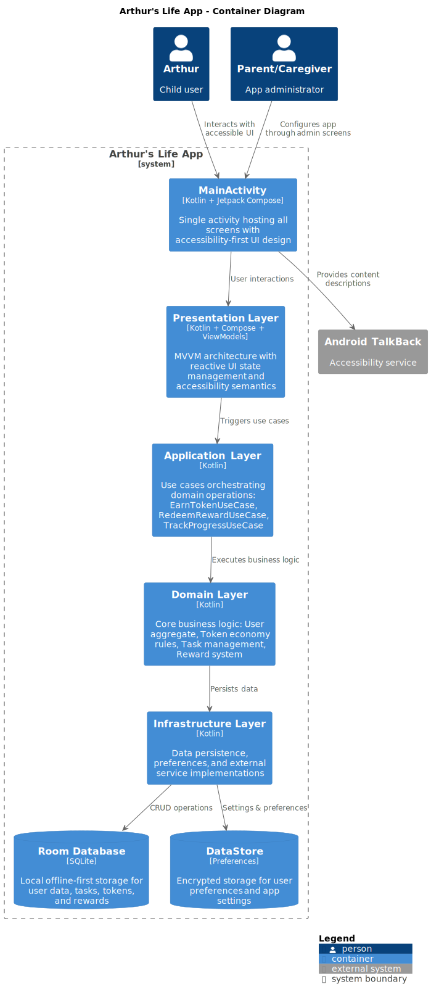

# Technology Stack

[🏠 Back to Main README](../README.md)

## 📋 Page Navigation

| Section | Description |
|---------|-------------|
| [Core Framework](#core-framework) | Main technologies |
| [Architecture](#architecture-implementation) | DDD implementation |
| [UI & Data](#ui--data-layer) | Frontend and data management |
| [Testing](#testing-framework) | Testing tools and strategies |

## 🔗 Related Documentation

| Topic | Link |
|-------|------|
| **Setup Guide** | [getting-started.md](getting-started.md) |
| **Contributing** | [contributing.md](contributing.md) |
| **Architecture** | [architecture.md](architecture.md) |
| **Testing** | [testing.md](testing.md) |

## Core Framework

- **Android Native** - Pure Android application
- **Kotlin 2.1.0** - Primary development language
- **Java 21 (preferred) / Java 17 (fallback)** - Target Java version for Android development
- **Jetpack Compose** - Modern declarative UI toolkit
- **Android Gradle Plugin 8.7.3** - Build system for Android
- **Gradle 8.11** - Build automation tool

## System Architecture



*High-level view of Arthur's Life app architecture showing the Android native components*

## Architecture Implementation

### Domain-Driven Design (DDD)

- **Aggregate Roots**: User, Task, Token, and Reward entities with business logic
- **Value Objects**: UserRole (Child/Caregiver/Admin), TaskCategory, TaskDifficulty, RewardCategory
- **Domain Events**: TaskCompletedEvent, TokensEarnedEvent, RewardRedeemedEvent
- **Repository Pattern**: Clean data access interfaces with TaskService and RewardService

### Application Layer

- **Use Cases**: EarnToken, RedeemReward, TrackProgress
- **Command/Query Separation** for CQRS implementation
- **Event-driven architecture** with domain events

## State Management

- **Hilt** - Dependency injection framework
- **Jetpack Compose State** - Built-in state management
- **Room Database** - Local data persistence
- **DataStore** - Key-value storage for preferences
- **Kotlin Coroutines** - Asynchronous programming
- **Flow** - Reactive data streams

## Type Safety & Validation

- **Kotlin** - Null-safe, type-safe programming language
- **Kotlinx Serialization** - Type-safe JSON serialization
- **Data Classes** - Immutable data structures
- **Sealed Classes** - Type-safe error handling

## Testing Framework

- **JUnit 5** - Unit testing framework
- **MockK** - Mocking library for Kotlin
- **Turbine** - Testing library for Kotlin Flow
- **Robolectric** - Android unit testing framework
- **Espresso** - UI testing framework
- **Detekt** - Static code analysis
- **KtLint** - Code formatting and style checking

## UI & Design System

- **Jetpack Compose** - Modern declarative UI
- **Material Design 3** - Google's design system with theming support
- **Theme System** - Role-based theming (Material Light/Dark, Mario Classic)
- **Compose Navigation** - Type-safe navigation
- **Coil** - Image loading library
- **TalkBack support** - Basic accessibility compliance
## Development Tools

- **Android Studio** - Official IDE for Android development
- **Detekt** - Static code analysis for Kotlin
- **KtLint** - Kotlin code formatting
- **Gradle** - Build automation and dependency management

## Project Structure

```
app/src/main/java/com/arthurslife/app/
├── domain/              # Business logic & entities
│   ├── user/           # User domain model with role-based access
│   ├── task/           # Task management with scheduling
│   ├── token/          # Token economy
│   └── reward/         # Reward system with categories
├── data/               # Data layer (repositories, data sources)
│   ├── local/         # Room database, DataStore
│   └── repository/    # Repository implementations
├── presentation/       # Jetpack Compose UI layer
│   ├── components/    # Reusable composables
│   ├── screens/       # Screen composables
│   ├── theme/         # Theme system with role-based theming
│   └── navigation/    # Navigation graph
├── di/                # Dependency injection modules
└── util/              # Utility classes and extensions
```

## Performance Features

- **R8 code shrinking** for smaller APKs
- **Lazy composition** with Compose
- **State hoisting** for efficient recomposition
- **Coroutines** for efficient async operations
- **Flow** for reactive data streams
- **Room caching** with in-memory database
- **Image optimization** with Coil

## Local Storage & Persistence

- **Room Database** - SQLite abstraction with compile-time verification
- **DataStore** - Type-safe key-value storage
- **Android Keystore** - Secure storage for sensitive data
- **Database migrations** - Schema evolution support

## Security Implementation

- **ProGuard/R8** - Code obfuscation and optimization
- **Network Security Config** - Secure network communication
- **Android Keystore** - Hardware-backed key storage
- **Input validation** - Comprehensive data validation

## Platform Support

- **Android API 24+** - Android 7.0 and above
- **Phones and Tablets** - Adaptive UI for all screen sizes
- **Dark/Light Theme** - System theme support
- **TalkBack** - Basic accessibility support

## Technology Decision Rationale

### Why Android Native?

**Decision:** Pure Android native development

**Rationale:** 
- **Performance:** Real-time token calculations and smooth animations  
- **Platform Integration:** Deep integration with Android's system features
- **Long-term Maintenance:** Easier to maintain single platform codebase
- **TalkBack Support:** Native accessibility framework integration

### Why Kotlin?

**Decision:** Kotlin as primary language

**Rationale:**
- **Null Safety:** Critical for child-safety features
- **Coroutines:** Simplifies async operations for token calculations
- **Conciseness:** Reduces boilerplate, improves code readability
- **Google Support:** First-class Android support

### Why Jetpack Compose?

**Decision:** Jetpack Compose for UI

**Rationale:**
- **Modern Development:** Future-proof Android UI framework
- **Dynamic UI:** Token counters and progress animations
- **State Management:** Reactive UI updates for real-time feedback
- **Better Semantics:** Improved accessibility support

### Why Room Database?

**Decision:** Room database

**Rationale:**
- **Offline-First:** App functionality without internet connection
- **Type Safety:** Compile-time SQL validation
- **Migration Support:** Safe schema evolution
- **Integration:** Seamless Kotlin coroutines support

## Architecture Benefits

- **Native Performance** - Full Android platform access
- **Type Safety** - Kotlin's null safety and type system  
- **Clean Architecture** - MVVM with Repository pattern
- **Developer Experience** - Android Studio tooling and debugging
- **Maintainable Code** - SOLID, DRY, and DDD principles

---

[🏠 Back to Main README](../README.md) | [🚀 Setup Guide](getting-started.md) | [📝 Contributing](contributing.md) | [🏗️ Architecture](architecture.md)
│   ├── theme/         # Material Design theme
│   └── navigation/    # Navigation graph
└── utils/              # Utility classes and extensions
```

## Performance Features

- **R8 code shrinking** for smaller APKs
- **Lazy composition** with Compose
- **State hoisting** for efficient recomposition
- **Coroutines** for efficient async operations
- **Flow** for reactive data streams
- **Room caching** with in-memory database
- **Image optimization** with Coil

## Accessibility Implementation

- **Cognitive accessibility focus** with simple language and clear navigation
- **Screen reader support** with basic TalkBack integration
- **High contrast themes** available through theme system
- **Large text support** respecting system font settings
- **Standard touch targets** with minimum 44dp sizing

## Local Storage & Persistence

- **Room Database** - SQLite abstraction with compile-time verification
- **DataStore** - Type-safe key-value storage
- **Android Keystore** - Secure storage for sensitive data
- **Encrypted SharedPreferences** - Secure preference storage
- **Database migrations** - Schema evolution support

## Security Implementation

- **ProGuard/R8** - Code obfuscation and optimization
- **Network Security Config** - Secure network communication
- **Certificate pinning** - Protection against MITM attacks
- **Biometric authentication** - Secure user authentication
- **Android Keystore** - Hardware-backed key storage

## Platform Support

- **Android API 24+** - Android 7.0 and above
- **Phones and Tablets** - Adaptive UI for all screen sizes
- **Dark/Light Theme** - System theme support
- **Accessibility** - TalkBack and accessibility services

## Technology Decision Rationale

### Why Android Native vs Cross-Platform?

**Decision:** Pure Android native development

**Rationale:** 
- **Accessibility Requirements:** Arthur needs TalkBack and Android accessibility services
- **Performance:** Real-time token calculations and smooth animations  
- **Platform Integration:** Deep integration with Android's accessibility framework
- **Long-term Maintenance:** Easier to maintain single platform codebase

### Why Kotlin vs Java?

**Decision:** Kotlin as primary language

**Rationale:**
- **Null Safety:** Critical for child-safety features
- **Coroutines:** Simplifies async operations for token calculations
- **Conciseness:** Reduces boilerplate, improves code readability
- **Google Support:** First-class Android support

### Why Jetpack Compose vs XML?

**Decision:** Jetpack Compose for UI

**Rationale:**
- **Accessibility:** Better semantic properties support
- **Dynamic UI:** Token counters and progress animations
- **State Management:** Reactive UI updates for real-time feedback
- **Modern Development:** Future-proof Android UI framework

### Why Room vs Other Databases?

**Decision:** Room database

**Rationale:**
- **Offline-First:** Arthur needs access without internet
- **Type Safety:** Compile-time SQL validation
- **Migration Support:** Safe schema evolution
- **Integration:** Works seamlessly with Kotlin coroutines

## Architecture Benefits

- **Native Performance** - Full Android platform access
- **Type Safety** - Kotlin's null safety and type system  
- **Clean Architecture** - MVVM with Repository pattern
- **Accessibility First** - TalkBack and accessibility services
- **Developer Experience** - Android Studio tooling and debugging

---

[🏠 Back to Main README](../README.md) | [🚀 Setup Guide](getting-started.md) | [📝 Contributing](contributing.md) | [🏗️ Architecture](architecture.md)
