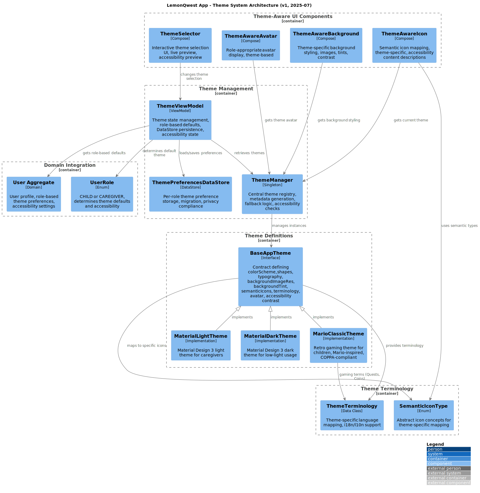

---
post_title: Theme System Technical Documentation
author1: Raphael Almeida
post_slug: theme-system
microsoft_alias: almeidaraphael
featured_image: diagrams/theme-system-architecture.svg
categories: [architecture, ui, theming]
tags: [theme, material, mario, role-based, jetpack-compose]
ai_note: true
summary: Role-based theme system for Arthur's Life app, supporting Material and Mario Classic themes with deep UI integration.
post_date: 2025-01-06
---

## Theme System Technical Documentation

**Back to:** [Docs Hub](README.md) | [Main README](../README.md)


Comprehensive theme management system providing role-based customization and deep UI integration for Arthur's Life Android application.

## Document Overview

### Purpose
Describes theme system architecture, available themes, and implementation details for role-based user experience customization and consistent theme management.

### Audience
- UI developers implementing theme-aware components
- Designers and architects planning theme customizations
- Prerequisite: Familiarity with Material Design 3, Jetpack Compose, and Android development

### Scope
Covers theme architecture, available themes, role-based defaults, and component integration. Excludes visual design specifications and branding guidelines.

## Quick Reference

### Key Information
- Role-based theme system: Material Design 3 and Mario Classic theme
- Status: Complete, actively maintained
- Last Updated: 2025-01-06
- Related: [Architecture](architecture.md), [Tech Stack](tech-stack.md)

### Common Tasks
- Understanding available themes
- Role-based theme defaults
- Theme architecture overview
- Implementing theme components

## Main Content

### Overview
Arthur's Life app features a theme management system for role-based customization, including colors, terminology, icons, backgrounds, and user experience elements.

#### Key Features
- Role-based defaults: Child and Caregiver themes
- Customization: Colors, shapes, typography, icons, backgrounds, terminology
- Semantic theming: Theme-specific language and experience
- Persistent preferences: Per-role theme settings
- Theme-aware components: UI adapts to selected theme

## Available Themes

### Material Light Theme
Target: Caregivers, professional users
Design: Clean Material Design 3
Colors: Light background, Material palette
Typography: Standard Material scales
Shapes: Rounded corners
Terminology: Professional language
Avatar: Professional user icon
Use case: Adults preferring minimalist interfaces

### Material Dark Theme
Target: Users preferring dark mode
Design: Material Design 3 dark variant
Colors: Dark backgrounds, high contrast
Typography: Matches light theme
Shapes: Rounded corners
Terminology: Professional
Avatar: Professional user icon
Use case: Low-light, dark theme preference

### Mario Classic Theme
Target: Children, gaming fans
Design: Playful, retro Mario aesthetic
Colors: Vibrant Mario palette
Typography: Monospace, retro
Shapes: Pixel-perfect, no rounded corners
Terminology: Gaming language
Background: Mario yellow tint
Avatar: Mushroom icon
Use case: Playful, game-like interface

## Role-Based Defaults

### Child Role: Mario Classic Theme
Engaging, fun interface for children. Uses gaming terminology, bright colors, retro styling, and motivational elements.

### Caregiver Role: Material Light Theme
Professional, clean interface for monitoring and management. Uses clear terminology, high readability, and efficient design.

### Theme Switching
- Users can override defaults in Settings
- Preferences saved per role
- Immediate application on role switch
- No restriction on theme choice

## Theme Architecture




System includes:
- Theme definitions: BaseAppTheme interface, MaterialLight, MaterialDark, MarioClassic
- Theme management: ThemeManager, ThemeViewModel, ThemePreferencesDataStore
- Theme-aware UI: ThemeAwareIcon, ThemeAwareAvatar, ThemeAwareBackground, ThemeSelector
- Domain integration: User aggregate, UserRole enum
- Terminology system: ThemeTerminology, SemanticIconType
- Role-based defaults

### BaseAppTheme Interface
Defines contract for all themes:

```kotlin
interface BaseAppTheme {
    // Material Design 3 theming
    val colorScheme: ColorScheme
    val shapes: Shapes  
    val typography: Typography
    
    // Theme-specific customization
    val backgroundImageRes: Int?
    val backgroundTint: Color?
    val semanticIcons: Map<SemanticIconType, ImageVector>
    val terminology: ThemeTerminology
    val avatar: String
}
```

### Theme Management Components

#### ThemeManager
Central registry and lookup. Location: `presentation/theme/ThemeManager.kt`. Registers themes, provides lookup, generates metadata, handles fallbacks.

#### ThemeViewModel
Manages theme state and persistence. Location: `presentation/theme/ThemeViewModel.kt`. Loads preferences, applies defaults, saves selections, provides reactive state.

#### ThemePreferencesDataStore
Persistent theme storage. Location: `data/theme/ThemePreferencesDataStore.kt`. Stores preferences per role, provides fallbacks, manages DataStore operations and migrations.

## Theme Components

### Theme-Aware UI Components

#### Semantic Icon System
Maps abstract icon concepts to theme-specific icons (e.g., clipboard vs sword for tasks).

#### ThemeAwareIcon Component
```kotlin
@Composable
fun ThemeAwareIcon(
    semanticType: SemanticIconType,
    contentDescription: String?,
    modifier: Modifier = Modifier,
    tint: Color = LocalContentColor.current
)
```

#### ThemeAwareAvatar Component
Displays role-appropriate avatar. Mario: mushroom icon. Material: professional user icon. Adapts automatically.

#### ThemeAwareBackground Component
Applies theme-specific background styling. Supports images and color tints.

### Theme Selector UI

#### Theme Selection Interface
Location: `presentation/theme/components/ThemeSelector.kt`. Visual preview, name/description, interactive selection, theme-aware styling.

#### Theme Settings Screen
Location: `presentation/screens/ThemeSettingsScreen.kt`. Role-based management, navigation, persistence, live preview.

### Terminology System

Each theme defines its own terminology:

| Concept   | Material Themes | Mario Theme   |
|-----------|----------------|--------------|
| Tasks     | Tasks           | Quests       |
| Tokens    | Badges          | Coins        |
| Rewards   | Rewards         | Power-ups    |
| Settings  | Settings        | Castle Guardian |
| Profile   | Profile         | Player Card  |

## Integration Points

### Application Level
- MainActivity: Loads theme by user role
- Theme context: Available throughout app
- Navigation: Theme-aware components
- State preservation: Theme context across screens

### Component Integration
- UI components: Automatic theme adaptation
- Icons/images: Semantic mapping
- Text/labels: Theme terminology
- Colors/styling: Material Design 3 integration

### Data Persistence
- Per-role storage: Separate preferences
- Default assignments: Automatic for new users
- Migration support: Handles schema changes
- Synchronization: Preferences sync across sessions

## Customization Capabilities

### Deep Theme Customization
- Visual styling: Colors, typography, shapes
- Icon system: Theme-specific sets
- Background styling: Custom backgrounds, tints
- Component shapes: Rounded vs pixel-perfect

### User Experience Customization
- Terminology: Theme-appropriate language
- Interaction: Theme-consistent UI patterns
- Motivation: Theme-specific messages
- Avatar: Role/theme-appropriate icons

### Technical Benefits
- Extensible: Add new themes via BaseAppTheme
- Consistent: Centralized theming
- Performance: Efficient switching
- Maintainable: Separation from business logic

## Integration Points

### Dependencies
- [Architecture](architecture.md): Theme architecture
- [Tech Stack](tech-stack.md): Jetpack Compose, Material Design 3
- [App Structure](../planning/app-structure.md): Application structure, user roles

### Related Features
- UI Components: Compose components integrate with theme system
- User Management: Role-based defaults, preferences
- Data Persistence: Theme preferences with DataStore
- Navigation: Theme-aware navigation

## Success Metrics

### Implementation Goals
- Role-based experience: Defaults for Child and Caregiver
- Deep customization: Colors, typography, icons, terminology, backgrounds
- User choice: Override defaults, select preferred themes
- Technical excellence: Efficient switching, consistency

### Quality Indicators
- Theme consistency: UI adapts to theme changes
- Performance: No degradation on switching
- Usability: Role-appropriate themes
- Maintainability: Easy addition of new themes

## Implementation Status

Current Status: Complete

### Completed Features
- BaseAppTheme interface and architecture
- Material Light/Dark themes
- Mario Classic theme
- Role-based defaults
- Theme management and persistence
- Semantic icon system, terminology customization

### Future Enhancements
- Additional child theme options
- Custom theme creation tools
- Advanced theme scheduling
- Accessibility enhancements

## Maintenance

### Regular Updates
- Update when adding themes, updating guidelines, or expanding options
- Review consistency, update components, validate accessibility
- Monthly review, quarterly enhancement evaluation

### Version History
- v1.0.0 (2025-01-06): Initial theme system

## Additional Resources

### Internal Documentation
- [Architecture](architecture.md): System design patterns
- [Tech Stack](tech-stack.md): Jetpack Compose, Material Design 3
- [Development Guide](development.md): Theme development workflow

### External Resources
- [Material Design 3](https://m3.material.io/)
- [Jetpack Compose Theming](https://developer.android.com/jetpack/compose/themes)
- [Material Theme Builder](https://m3.material.io/theme-builder)
- [Android Theming](https://developer.android.com/guide/topics/ui/look-and-feel/themes)

### Tools and Utilities
- [Material Theme Builder](https://m3.material.io/theme-builder)
- [Jetpack Compose](https://developer.android.com/jetpack/compose)
- [DataStore](https://developer.android.com/topic/libraries/architecture/datastore)
- [Compose Previews](https://developer.android.com/jetpack/compose/tooling)


## Contributing

### How to Contribute
1. Use BaseAppTheme interface for new themes
2. Ensure theme components work across UI
3. Test theme switching and adaptation
4. Update documentation for new features

### Review Process
1. Validate theme patterns and interface
2. Ensure good user experience and accessibility
3. Confirm efficient implementation
4. Verify integration with components

### Style Guidelines
- Follow Material Design 3 principles
- Maintain visual hierarchy and accessibility
- Use semantic naming for theme properties/components
- Document customization rationale and usage


**Navigation**: [Docs Hub](README.md) | [Main README](../README.md) | [Planning](../planning/README.md)