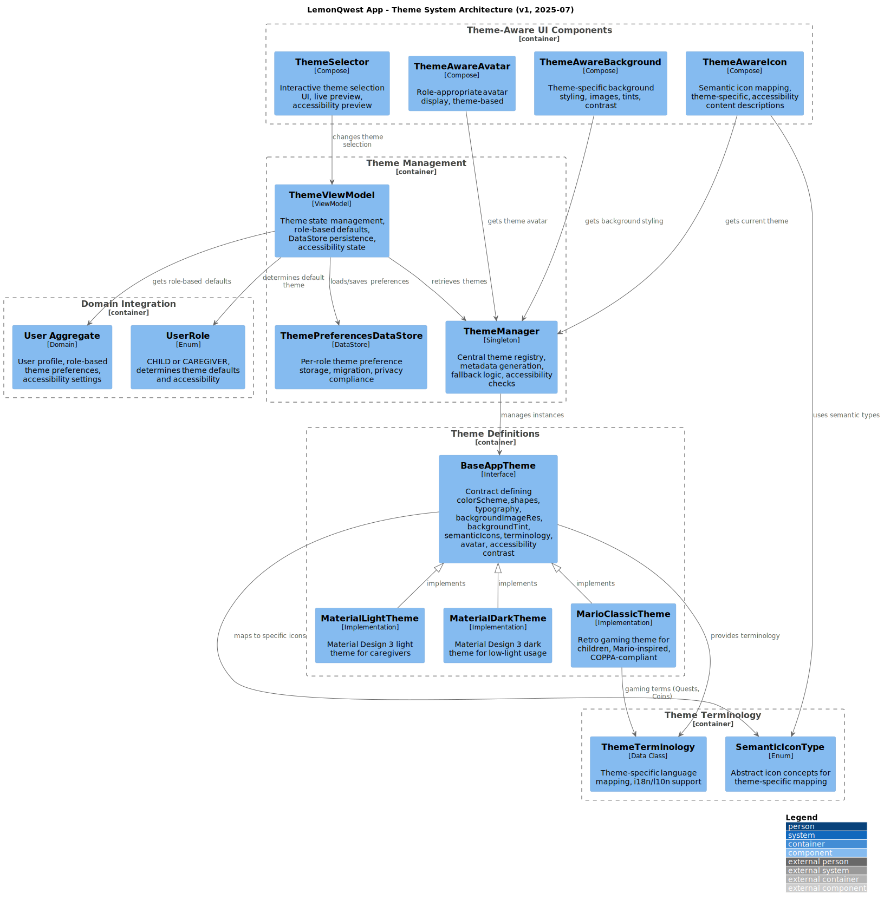

# Theme System - Technical Documentation

[🏠 Back to Docs Hub](README.md) | [🏠 Main README](../README.md)

Comprehensive theme management system providing role-based customization with deep UI integration for Arthur's Life Android application.

## 📋 Document Overview

### Purpose
Document the theme system architecture, available themes, and implementation details to support role-based user experience customization and maintain consistent theme management across the application.

### Audience
- **Primary**: UI developers implementing theme-aware components
- **Secondary**: Designers and architects planning theme customizations
- **Prerequisites**: Understanding of Material Design 3, Jetpack Compose theming, and Android development

### Scope
Covers theme architecture, available themes, role-based defaults, and component integration. Does not include visual design specifications or branding guidelines.

## 🎯 Quick Reference

### Key Information
- **Summary**: Role-based theme system with Material Design 3 and custom Mario Classic theme
- **Status**: Complete - actively maintained
- **Last Updated**: 2025-01-06
- **Related**: [Architecture](architecture.md), [Tech Stack](tech-stack.md)

### Common Tasks
- [Understanding Available Themes](#available-themes)
- [Role-Based Theme Defaults](#role-based-defaults)
- [Theme Architecture Overview](#theme-architecture)
- [Implementing Theme Components](#theme-components)

## 📖 Main Content

### Section 1: Overview

Arthur's Life app features a comprehensive theme management system that provides role-based theme customization with deep integration throughout the user interface. The system goes beyond simple color changes to include customized terminology, icons, backgrounds, and even user experience elements.

#### Key Features

- **Role-based defaults**: Different themes for Child and Caregiver roles
- **Deep customization**: Colors, shapes, typography, icons, backgrounds, and terminology
- **Semantic theming**: Theme-specific language and user experience elements
- **Persistent preferences**: Individual theme settings per user role
- **Theme-aware components**: All UI components automatically adapt to selected theme

### Section 2: Available Themes

### Material Light Theme
- **Target audience**: Caregivers and professional users
- **Design philosophy**: Clean, professional Material Design 3 implementation
- **Color scheme**: Light background with Material You color palette
- **Typography**: Standard Material Design typography scales
- **Shapes**: Rounded corners (4dp to 28dp) for modern feel
- **Terminology**: Professional language ("Tasks", "Badges", "Settings")
- **Avatar**: 👤 (professional user icon)
- **Use case**: Adult users who prefer clean, minimalist interfaces

### Material Dark Theme  
- **Target audience**: Users preferring dark interfaces
- **Design philosophy**: Dark mode variant of Material Design 3
- **Color scheme**: Dark backgrounds with high contrast elements
- **Typography**: Same as Material Light for consistency
- **Shapes**: Matching rounded corner system
- **Terminology**: Professional language matching light theme
- **Avatar**: 👤 (same professional styling)
- **Use case**: Low-light usage and users who prefer dark themes

### Mario Classic Theme
- **Target audience**: Children and gaming enthusiasts
- **Design philosophy**: Playful, game-inspired retro aesthetic
- **Color scheme**: Vibrant Mario-inspired palette (red, blue, green, yellow, orange)
- **Typography**: Monospace fonts for retro gaming feel
- **Shapes**: Pixel-perfect design with 0dp rounded corners
- **Terminology**: Gaming language ("Quests", "Coins", "Castle Guardian")
- **Background**: Mario yellow tint for immersive experience
- **Avatar**: 🍄 (mushroom power-up icon)
- **Use case**: Children who enjoy gaming aesthetics and playful interfaces

## Role-Based Defaults

### Child Role → Mario Classic Theme
- **Rationale**: Engaging, fun interface that appeals to children
- **Gaming terminology**: Makes tasks feel like game quests
- **Bright colors**: Vibrant palette maintains engagement
- **Retro styling**: Familiar gaming aesthetic
- **Motivation**: Game-like experience encourages task completion

### Caregiver Role → Material Light Theme
- **Rationale**: Professional, clean interface for monitoring and management
- **Clear terminology**: Standard language for task management
- **High readability**: Optimized for information consumption
- **Professional aesthetics**: Suitable for adult users
- **Efficiency**: Streamlined interface for management tasks

### Theme Switching
- Users can override default themes through Settings
- Theme preferences are saved per role
- Immediate application when switching between roles
- No restriction on theme choice per role

## Theme Architecture

### Theme System Architecture Diagram



The comprehensive theme system architecture shows:
- **Theme Definitions**: BaseAppTheme interface with MaterialLight, MaterialDark, and MarioClassic implementations
- **Theme Management**: ThemeManager for registry and lookup, ThemeViewModel for state management, ThemePreferencesDataStore for persistence
- **Theme-Aware UI Components**: ThemeAwareIcon, ThemeAwareAvatar, ThemeAwareBackground, and ThemeSelector components
- **Domain Integration**: User aggregate with role-based theme preferences and UserRole enum for defaults
- **Terminology System**: ThemeTerminology and SemanticIconType for theme-specific language and icons
- **Role-Based Defaults**: Child role defaults to Mario Classic, Caregiver role defaults to Material Light

### BaseAppTheme Interface
The foundation of the theme system, defining the contract all themes must implement:

```kotlin
interface BaseAppTheme {
    // Material Design 3 theming
    val colorScheme: ColorScheme
    val shapes: Shapes  
    val typography: Typography
    
    // Theme-specific customization
    val backgroundImageRes: Int?
    val backgroundTint: Color?
    val semanticIcons: Map<SemanticIconType, ImageVector>
    val terminology: ThemeTerminology
    val avatar: String
}
```

### Theme Management Components

#### ThemeManager
- **Purpose**: Central theme registry and lookup system
- **Location**: `presentation/theme/ThemeManager.kt`
- **Responsibilities**:
  - Register all available themes
  - Provide theme lookup by key
  - Generate theme metadata for UI
  - Handle fallback logic for missing themes

#### ThemeViewModel  
- **Purpose**: Theme state management and persistence
- **Location**: `presentation/theme/ThemeViewModel.kt`
- **Responsibilities**:
  - Load theme preferences based on user role
  - Apply default themes for new users
  - Save theme selections to DataStore
  - Provide reactive theme state to UI

#### ThemePreferencesDataStore
- **Purpose**: Persistent theme storage
- **Location**: `data/theme/ThemePreferencesDataStore.kt`
- **Responsibilities**:
  - Store theme preferences per role
  - Provide default theme fallbacks
  - Handle DataStore operations
  - Manage preference migrations

## Theme Components

### Theme-Aware UI Components

#### Semantic Icon System
Maps abstract icon concepts to theme-specific implementations:
- **Tasks**: Different icons per theme (clipboard vs sword)
- **Rewards**: Theme-appropriate representations (gift vs treasure)
- **Progress**: Context-specific progress indicators
- **Settings**: Theme-consistent configuration icons

#### ThemeAwareIcon Component
```kotlin
@Composable
fun ThemeAwareIcon(
    semanticType: SemanticIconType,
    contentDescription: String?,
    modifier: Modifier = Modifier,
    tint: Color = LocalContentColor.current
)
```

#### ThemeAwareAvatar Component
- Displays role-appropriate avatar based on current theme
- Mario theme: 🍄 mushroom icon
- Material themes: 👤 professional user icon
- Automatic adaptation when theme changes

#### ThemeAwareBackground Component
- Applies theme-specific background styling
- Supports both background images and color tints
- Mario theme: Yellow background tint
- Material themes: Standard Material Design backgrounds

### Theme Selector UI

#### Theme Selection Interface
- **Location**: `presentation/theme/components/ThemeSelector.kt`
- **Features**:
  - Visual theme preview with color swatches
  - Theme name and description display
  - Interactive selection with immediate preview
  - Theme-aware styling of selector itself

#### Theme Settings Screen
- **Location**: `presentation/screens/ThemeSettingsScreen.kt`
- **Integration**:
  - Role-based theme management
  - Navigation integration
  - Settings persistence
  - Live theme preview

### Terminology System

Each theme defines its own terminology for consistent user experience:

| Concept | Material Themes | Mario Theme |
|---------|----------------|-------------|
| Tasks | "Tasks" | "Quests" |
| Tokens | "Badges" | "Coins" |
| Rewards | "Rewards" | "Power-ups" |
| Settings | "Settings" | "Castle Guardian" |
| Profile | "Profile" | "Player Card" |

## Integration Points

### Application Level
- **MainActivity**: Automatic theme loading based on authenticated user role
- **Theme context**: Available throughout entire app component tree
- **Navigation**: Theme-aware navigation components and styling
- **State preservation**: Theme context maintained across screen transitions

### Component Integration
- **All UI components**: Automatic theme adaptation through composition locals
- **Icons and images**: Semantic mapping ensures theme consistency
- **Text and labels**: Terminology system provides theme-appropriate language
- **Colors and styling**: Material Design 3 color scheme integration

### Data Persistence
- **Per-role storage**: Separate theme preferences for each user role
- **Default assignments**: Automatic theme assignment for new users
- **Migration support**: Handles theme preference schema changes
- **Synchronization**: Theme preferences sync across app sessions

## Customization Capabilities

### Deep Theme Customization
- **Visual styling**: Complete color scheme, typography, and shape customization
- **Icon system**: Theme-specific icon sets with semantic mapping
- **Background styling**: Custom backgrounds with tint overlays
- **Component shapes**: Theme-specific shape systems (rounded vs pixel-perfect)

### User Experience Customization
- **Terminology**: Theme-appropriate language throughout the app
- **Interaction patterns**: Theme-consistent user interface patterns
- **Motivational elements**: Theme-specific motivational messages
- **Avatar representation**: Role and theme-appropriate user avatars

### Technical Benefits
- **Extensibility**: Easy addition of new themes through BaseAppTheme interface
- **Consistency**: Centralized theming ensures uniform application
- **Performance**: Efficient theme switching with minimal recomposition
- **Maintainability**: Clear separation of theme concerns from business logic

## 🔗 Integration Points

### Dependencies
- **Internal**: [Architecture](architecture.md) - Theme architecture patterns and design principles
- **Internal**: [Tech Stack](tech-stack.md) - Jetpack Compose and Material Design 3 implementation
- **Planning**: [App Structure](../planning/app-structure.md) - Overall application structure and user roles

### Related Features
- **UI Components**: All Compose components integrate with theme system
- **User Management**: Role-based theme defaults and preferences
- **Data Persistence**: Theme preferences storage with DataStore
- **Navigation**: Theme-aware navigation and screen transitions

## 📊 Success Metrics

### Implementation Goals
- **Role-Based Experience**: Appropriate default themes for Child and Caregiver roles
- **Deep Customization**: Theme affects colors, typography, icons, terminology, and backgrounds
- **User Choice**: Users can override defaults and select preferred themes
- **Technical Excellence**: Efficient theme switching and consistent application

### Quality Indicators
- **Theme Consistency**: All UI components properly adapt to theme changes
- **Performance**: Theme switching occurs without performance degradation
- **Usability**: Role-appropriate themes enhance user experience
- **Maintainability**: Easy addition of new themes through established interfaces

## 🚧 Implementation Status

**Current Status**: Complete

### Completed Features
- [x] BaseAppTheme interface and theme architecture
- [x] Material Light and Dark themes with professional styling
- [x] Mario Classic theme with gaming-inspired design
- [x] Role-based theme defaults (Child → Mario, Caregiver → Material Light)
- [x] Theme management components and persistence
- [x] Semantic icon system and terminology customization

### Future Enhancements
- [ ] Additional theme options for different child preferences
- [ ] Custom theme creation tools for families
- [ ] Advanced theme scheduling (time-based themes)
- [ ] Theme accessibility enhancements

## 🔄 Maintenance

### Regular Updates
- **When to Update**: When adding new themes, updating Material Design guidelines, or expanding customization options
- **Update Process**: Review theme consistency, update components, validate accessibility
- **Review Schedule**: Monthly theme consistency review, quarterly enhancement evaluation

### Version History
- **v1.0.0** (2025-01-06): Initial theme system with Material and Mario Classic themes

## 📚 Additional Resources

### Internal Documentation
- [Architecture](architecture.md) - System design patterns affecting theme implementation
- [Tech Stack](tech-stack.md) - Jetpack Compose and Material Design 3 technologies
- [Development Guide](development.md) - Theme development workflow and patterns

### External Resources
- [Material Design 3](https://m3.material.io/) - Design system guidelines and theming
- [Jetpack Compose Theming](https://developer.android.com/jetpack/compose/themes) - Compose theming documentation
- [Material Theme Builder](https://m3.material.io/theme-builder) - Theme customization tools
- [Android Theming](https://developer.android.com/guide/topics/ui/look-and-feel/themes) - Android theming concepts

### Tools and Utilities
- [Material Theme Builder](https://m3.material.io/theme-builder) - Theme design and generation
- [Jetpack Compose](https://developer.android.com/jetpack/compose) - UI framework supporting theming
- [DataStore](https://developer.android.com/topic/libraries/architecture/datastore) - Theme preference persistence
- [Compose Previews](https://developer.android.com/jetpack/compose/tooling) - Theme preview and testing

---

## 📝 Contributing

### How to Contribute
1. **Follow Theme Patterns**: Use established BaseAppTheme interface for new themes
2. **Maintain Consistency**: Ensure theme components work across all UI elements
3. **Test Thoroughly**: Validate theme switching and component adaptation
4. **Document Changes**: Update theme documentation for new features

### Review Process
1. **Theme Review**: Validate theme follows established patterns and interface
2. **Visual Review**: Ensure theme provides good user experience and accessibility
3. **Technical Review**: Confirm efficient implementation and performance
4. **Integration Review**: Verify theme works with all existing components

### Style Guidelines
- Follow Material Design 3 principles for professional themes
- Maintain clear visual hierarchy and accessibility standards
- Use semantic naming for theme properties and components
- Document theme customization rationale and usage guidelines

---

**Navigation**: [🏠 Docs Hub](README.md) | [🏠 Main README](../README.md) | [📋 Planning](../planning/README.md)